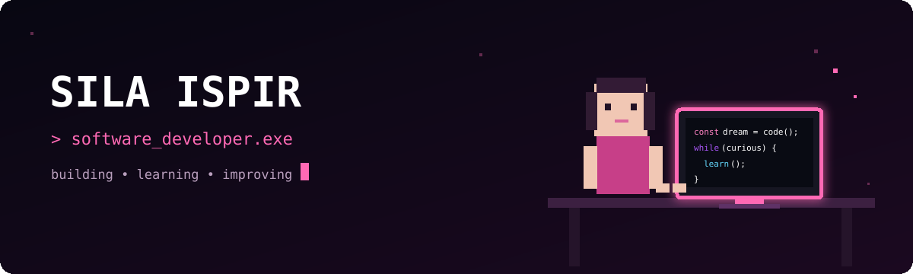

<p align="center"></p>

<p align="center"><a href="https://git.io/typing-svg"></a></p>

<p align="center">
  <a href="mailto:silaispir9505@gmail.com"></a>
  <a href="https://github.com/silaispir"></a>
  
</p>

<p align="center"></p>

```javascript
const sila = {
  role: "Software Developer",
  education: "Computer Engineering",
  location: "İstanbul, Türkiye",
  focus: ["Clean Code", "Web Development", "Continuous Learning"],
  motto: "Her gün dünden daha iyi."
};
```

<p align="center"></p>

<p align="center"></p>

<p align="center"></p>

<p align="center">
  
  
</p>

<p align="center"></p>

<p align="center">
  <picture>
    <source media="(prefers-color-scheme: dark)" srcset="https://raw.githubusercontent.com/silaispir/silaispir/output/github-snake.svg" />
    <source media="(prefers-color-scheme: light)" srcset="https://raw.githubusercontent.com/silaispir/silaispir/output/github-snake.svg" />
    
  </picture>
</p>

<p align="center"></p>

<p align="center"><i>build • learn • improve • repeat</i></p>
